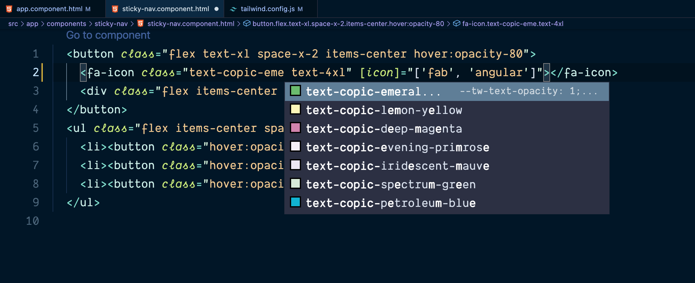
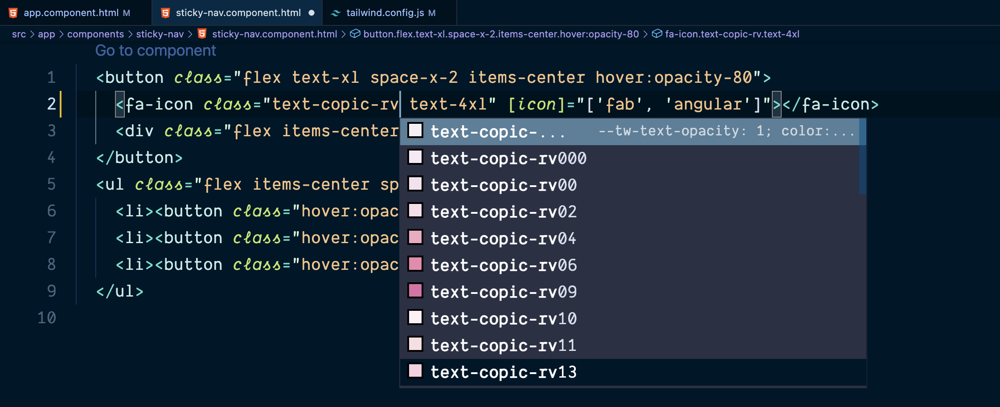

# Tailwindcss Colors




# Color Sets
- [x] [Copic 358 Colors](https://copic.jp/pdf/copic-catalog-en.pdf)
  - [x] name supported
  - [x] color system code supported
- [ ] Pantone
- [ ] Morandi

## Usage
- Installation
```sh
# npm
npm install @alanaudi/colors
# yarn
yarn add @alanaudi/colors
```

- Configuration
```js
// tailwind.config.js
const copicColors = require('@alanaudi/colors')

module.exports = {
  mode: 'jit',
  purge: {
    enabled: true,
    content: ['./src/**/*.{html,css,ts}'],
  },
  darkMode: class, // or 'media' or 'class'
  theme: {
    extend: {
      colors: {
        ...copicColors
      }
    },
  },
  variants: {
    extend: {},
  },
  plugins: [],
}

```
